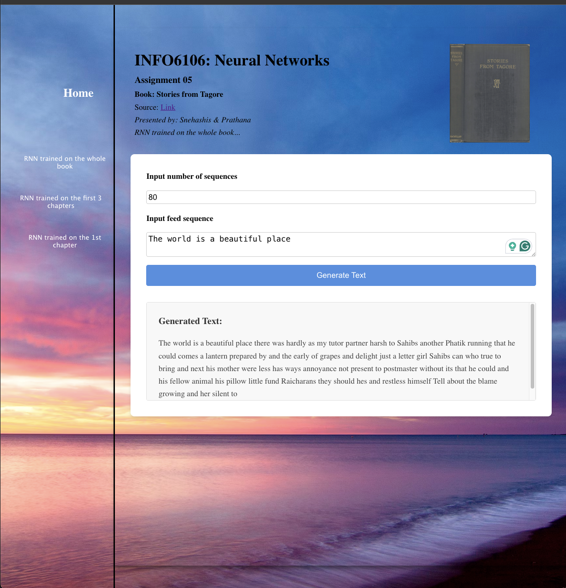

# Tagore-RNN-Python
<h2><i>RNN implementation using pure python</i></h2>

<h3>Course: INFO6106: Neural Networks</h3>

Implemented recurrent neural network using pure python

* Trained a RNN on a book from <a href="https://www.gutenberg.org/files/33525/33525-h/33525-h.htm">Gutenberg - Stories From Tagore - by Rabindranath Tagore</a>

* Trained on three instances 
  1. trained on whole book
  2. trained on first 3 chapters
  3. trained on just 1 chapter (the famous story of The Cabuliwallah)

* Trained on <b><i>Mac M2 Pro</i></b> with 16GB of ram, and also an instance from;
* Used <b><i>Paperspace by Digital Ocean</i></b> to train on a CPU instance with 4CPU and 8GB RAM
* Training time: 3 days on M2 Pro, and 5 days on the VM
* <b><i>Total vovabulary size: 5242</i></b>
* <b><i>Embedding used: Glove</i></b>

<h4>Inference</h4>
* Created <b><i>FastAPI API endpoints for real-time inference, loaded the model weights in the backend</i></b> 
* Created <b><i>React app for the frontend app used Socket.io client</i></b> <i>to communicate to the socket based backend</i> 

